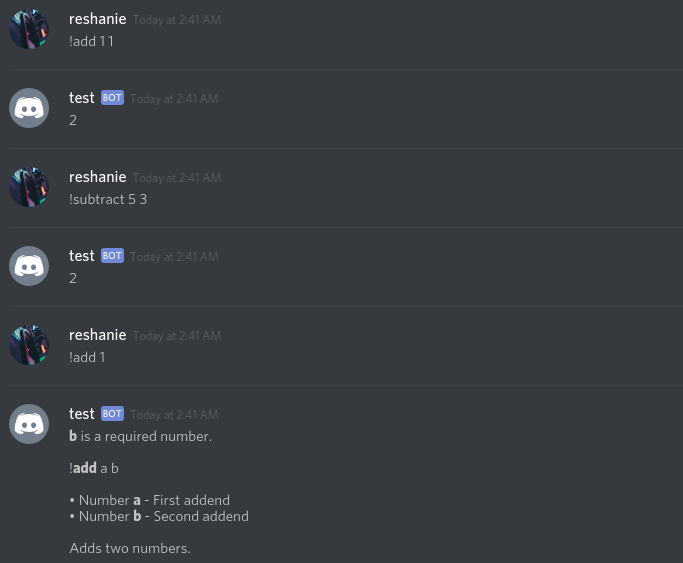

.. detache documentation master file, created by
   sphinx-quickstart on Mon Jun 11 14:56:03 2018.
   You can adapt this file completely to your liking, but it should at least
   contain the root `toctree` directive.

Détaché
=======

Détaché is a framework for creating productive and efficient Discord bots, built off of
`discord.py <http://github.com/Raptzz/discord.py/>`_.

With Détaché, you can easily create bots without sacrificing direct access to the API. Commands and similar features
are split into groups called Plugins, allowing for better organization. It's inspired by the simplicity of Click
and Flask.

Détaché's features include:

- intuitive argument parsing with support for custom types
- automatic documentation and help messages
- support for per-guild bot prefix via a callback
- support for sharding

Here's a simple bot that does math: ::

    import detache

    bot = detache.Bot(default_prefix="!")

    @bot.plugin("Math")
    class MathPlugin(detache.Plugin):
        """
        Basic math commands.
        """

        @detache.command("add", "Adds two numbers.")
        @detache.argument("a", detache.Number, help="First addend")
        @detache.argument("b", detache.Number, help="Second addend")
        async def add(self, ctx, a, b):
            return a + b

        @detache.command("subtract")
        @detache.argument("a", detache.Number, help="Minuend")
        @detache.argument("b", detache.Number, help="Subtrahend")
        async def subtract(self, ctx, a, b):
            """Subtracts two numbers."""

            return a - b

Both commands take two arguments, "a" and "b", which are specified as numbers. The commands return the sum or
difference, which Détaché automatically replies with.

Commands can be documented with the command decorator, or by using docstrings.

If argument parsing fails, the generated documentation will be shown.

TODO: Plugin, command, and argument descriptions are shown in the automatically generated help message.

You can install the library from PyPI: ::

    $ pip install detache

.. _doc-contents

Documentation
~~~~~~~~~~~~~

.. toctree::
    :maxdepth: 2

    quickstart
    arguments
